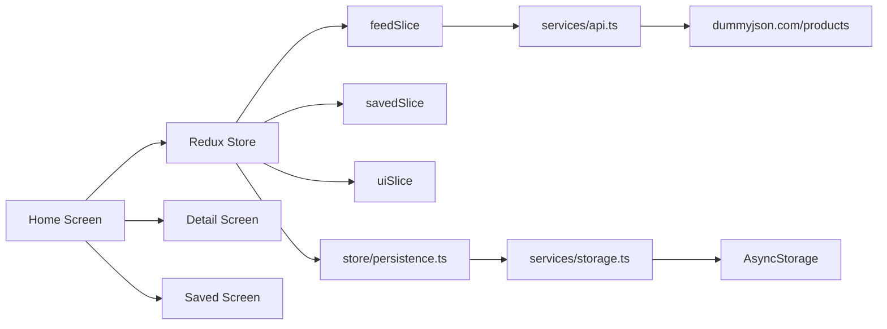
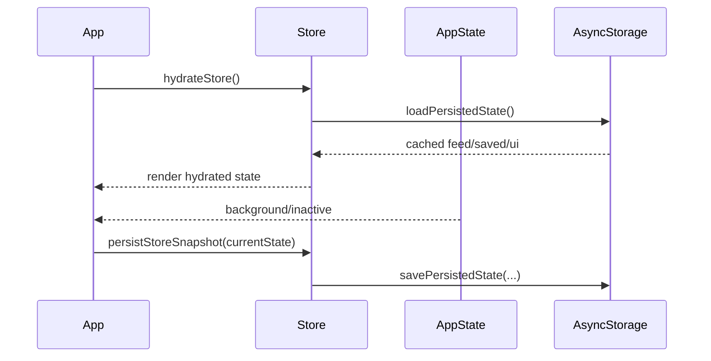

# Pulse - Intelligent Content Explorer

Pulse is a production-ready React Native mobile app built with TypeScript, focused on intelligent product discovery, smooth performance, and resilient offline behavior.

## Highlights

- React Native CLI + TypeScript architecture
- Functional components and React Hooks
- Redux Toolkit state domain split (`feedSlice`, `savedSlice`, `uiSlice`)
- React Navigation native stack transitions
- Network feed from `https://dummyjson.com/products`
- Pagination with infinite scrolling (`limit`/`skip`)
- Pull-to-refresh + retry on failures
- Debounced local search (400ms) from Redux state
- Offline-first read path with persisted cache
- Restore on launch: feed, saved list, search query, and list scroll position
- App lifecycle persistence via AppState background detection
- Premium dark UI using only core React Native components
- Custom skeleton loading and Animated press-scale interactions

## Architecture

### Module Layout

```txt
src/
	components/
		AnimatedPressable.tsx
		ListState.tsx
		ProductCard.tsx
		SearchBar.tsx
		SkeletonCard.tsx
	hooks/
		reduxHooks.ts
		useAppLifecycle.ts
		useDebouncedValue.ts
	navigation/
		AppNavigator.tsx
		types.ts
	screens/
		HomeScreen.tsx
		DetailScreen.tsx
		SavedScreen.tsx
	services/
		api.ts
		storage.ts
	slices/
		feedSlice.ts
		savedSlice.ts
		uiSlice.ts
	store/
		index.ts
		persistence.ts
		selectors.ts
	types/
		product.ts
	utils/
		theme.ts
```

### High-Level Flow



### Lifecycle Persistence Flow



## Feature Walkthrough

### 1) Feed Experience

- Loads paginated data from DummyJSON
- Supports infinite scroll and pull-to-refresh
- Shows custom skeleton while initial fetch is loading
- Handles empty and failure states with retry CTA

### 2) Search Experience

- Search input is debounced at 400ms
- Query stored in `uiSlice`
- Filter logic runs through memoized selectors

### 3) Saved Experience

- Any product can be bookmarked/unbookmarked
- Saved list is persisted and available offline
- Detail screen can load from feed cache or saved cache

### 4) Offline-First Strategy

- On startup, app hydrates from AsyncStorage first
- If API fails, existing cache remains usable
- Inline messaging indicates cache fallback mode

## Setup

### Prerequisites

- Node.js >= 22.11
- Android Studio + Android SDK (Linux/Windows/macOS)
- Xcode + CocoaPods (macOS for iOS builds)

### Install Dependencies

```bash
npm install
```

### Start Metro

```bash
npm start
```

### Run Android

```bash
npm run android
```

### Run iOS

```bash
cd ios && bundle exec pod install && cd ..
npm run ios
```

## Test on Physical Android Device

1. Enable `Developer options` and `USB debugging` on phone.
2. Connect phone via USB.
3. Verify device connection:

```bash
adb devices
```

4. Start Metro:

```bash
npm start
```

5. Install and run app:

```bash
npm run android
```

6. If bundler connection fails:

```bash
adb reverse tcp:8081 tcp:8081
```

## Quality Checks

```bash
npm run lint
npm test -- --watchAll=false
```

## Performance Notes

- FlatList optimized with:
	- `initialNumToRender`
	- `windowSize`
	- `maxToRenderPerBatch`
	- `updateCellsBatchingPeriod`
	- `removeClippedSubviews`
- `React.memo`, `useCallback`, and `useMemo` to reduce wasted renders
- Paginated item deduplication in reducer
- Animated interactions use native driver where applicable

## Production Decisions

- API logic isolated in service layer for testability
- Persistence encapsulated (`storage.ts` + `store/persistence.ts`)
- Slice-based state model for predictable, scalable updates
- Reusable UI primitives to keep screens thin and maintainable

## Future Improvements

- Background sync policy with stale-while-revalidate strategy
- Image caching strategy for lower bandwidth usage
- Expanded unit/integration tests for slices and selectors
- Network-aware UX state (online/offline banner)
- Analytics + crash reporting integration
- Accessibility audit (font scaling, labels, contrast tuning)
