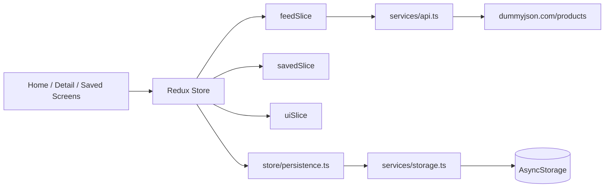
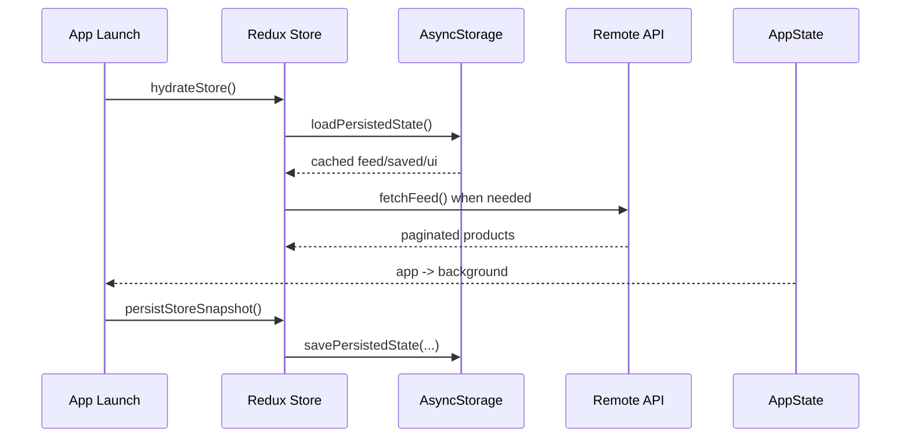

# Pulse - Intelligent Content Explorer

Pulse is a production-ready React Native app built with TypeScript using React Native CLI.

## Features

- Functional components with React Hooks
- Redux Toolkit with focused slices (`feedSlice`, `savedSlice`, `uiSlice`)
- React Navigation native stack setup
- AsyncStorage-powered persistence and hydration
- Infinite scrolling with paginated API loading (`limit` + `skip`)
- Pull-to-refresh, loading states, error states, empty states, retry flow
- Debounced search (400ms) using Redux-backed filtered selectors
- Offline-first behavior with cache fallback
- App lifecycle persistence via AppState background detection
- Animated press interactions and custom skeleton placeholders
- FlatList performance tuning for production scale

## Repository Structure

```txt
/
	README.md
	Pulse/
		App.tsx
		package.json
		src/
			components/
			hooks/
			navigation/
			screens/
			services/
			slices/
			store/
			types/
			utils/
```

## Architecture Diagram



## Data and Lifecycle Flow



## Setup

### 1) Clone and Install

```bash
git clone https://github.com/Kunal88591/react-native-app.git
cd react-native-app/Pulse
npm install
```

### 2) Run Metro

```bash
npm start
```

### 3) Run Android

```bash
npm run android
```

### 3.1) Build Release APK (Windows)

```powershell
cd Pulse\android
.\gradlew.bat clean
.\gradlew.bat assembleRelease
```

APK output:

```txt
Pulse/android/app/build/outputs/apk/release/app-release.apk
```

Important:
- Use `.\gradlew.bat` in PowerShell.
- The APK path is a file location, not a command.

### 4) Run iOS (macOS only)

```bash
cd ios && bundle exec pod install && cd ..
npm run ios
```

## Android Device Testing

```bash
adb devices
adb reverse tcp:8081 tcp:8081
cd Pulse
npm start
npm run android
```

## Quality Checks

```bash
cd Pulse
npm run lint
npm test -- --watchAll=false
```

## Technical Highlights

- Service layer split for API and local storage concerns
- Selector-driven filtered search to avoid expensive rerenders
- Memoized reusable UI components (`React.memo`)
- Reducer-side dedupe for paginated items
- Persisted scroll position and search query restoration

## Future Improvements

- Background sync policies with TTL and stale-while-revalidate
- Enhanced image caching strategy
- Broader reducer/selector integration tests
- Network-aware UI status banners
- Accessibility and analytics hardening

## App-Specific Detailed Docs

For full app-level documentation, see `Pulse/README.md`.
